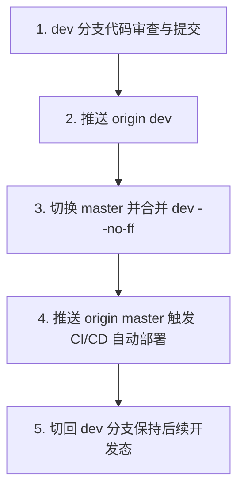

# Agent 工作准则与规范

## 一、 统一规范的「提交代码」标准 SOP

当用户发出 **“提交代码”** 或类似意图的指令时，**必须默认自动执行以下固化流程，无需用户再次提醒**：

### 详细步骤规范：

1. **第 1 步（本地提交）**：
   - 检查并在 `dev` 分支审查变动；
   - 确保代码格式良好且编译测试通过；
   - 执行 `git add` 并使用规范的 Conventional Commits 完成 `git commit`。
2. **第 2 步（同步 dev 远程）**：
   - 执行 `git push origin dev`，确保开发分支在远程有完整备份。
3. **第 3 步（合并 master）**：
   - 切换到 `master` 分支：`git checkout master && git pull origin master`；
   - 执行合并：`git merge dev --no-ff -m "Merge branch 'dev'"`。
4. **第 4 步（触发线上部署）**：
   - 执行 `git push origin master`；
   - 触发 master 主分支的 GitHub Actions CI/CD 自动化构建发布流程（如 Docker 镜像构建、推送及版本自增）。
5. **第 5 步（切回开发态）**：
   - 切换回 `dev` 分支：`git checkout dev && git merge master`；
   - 同步 `dev` 远端：`git push origin dev`；
   - 保证后续新需求继续在 `dev` 分支上稳健推进。
