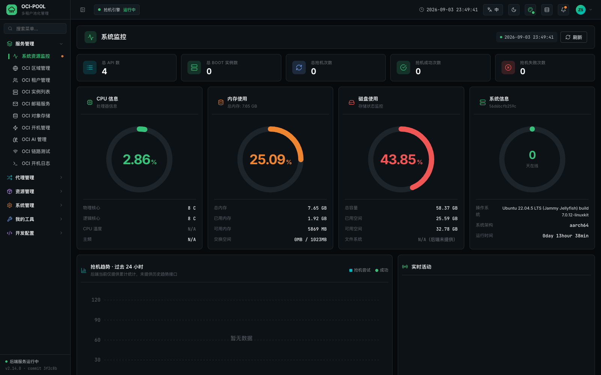
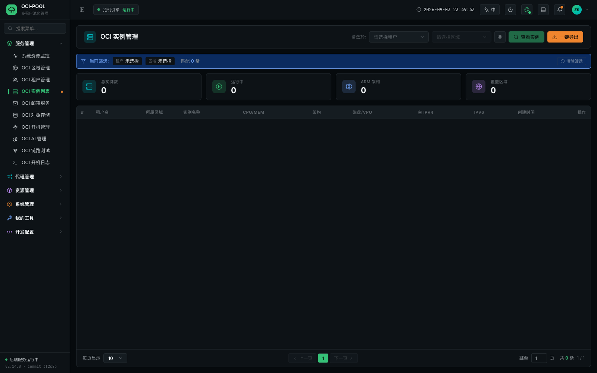
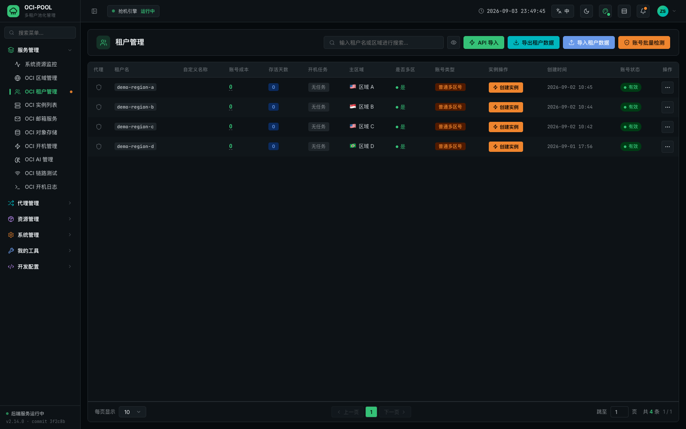
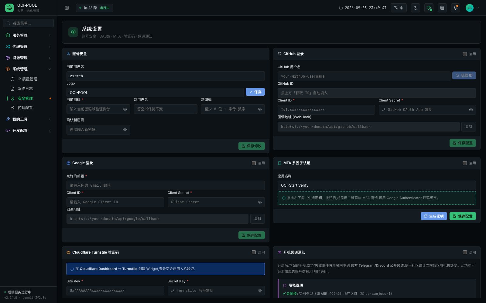
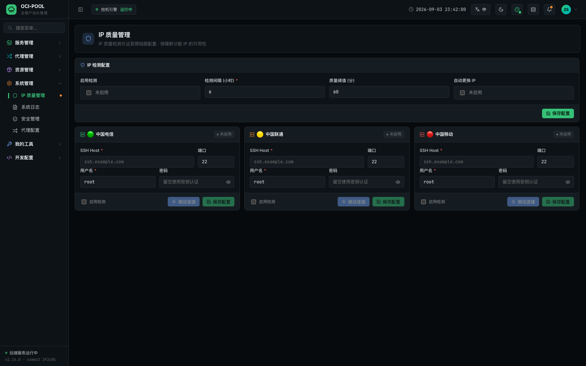
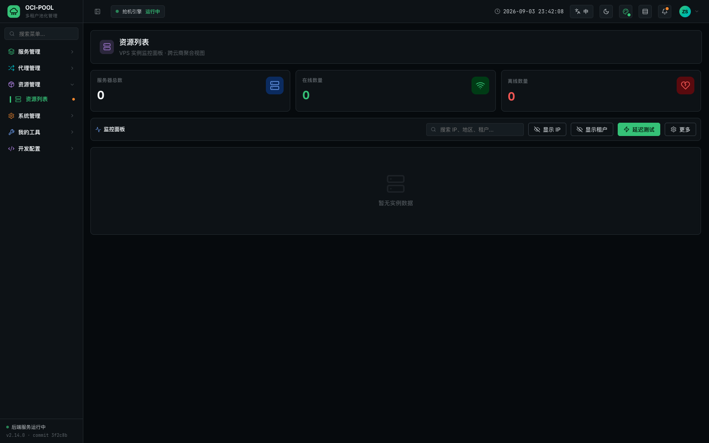

<div align="center">

# OCI-Pool

**基于 API 集成的 Oracle Cloud 实例创建与管理系统(基于 OCI-Start 的二次开发分支)**

[](https://github.com/Nodewebzsz/oci-pool/stargazers)
[](LICENSE)
[](https://github.com/Nodewebzsz/oci-pool/issues)
[](https://www.java.com)
[](https://www.docker.com)

[English](./README.en.md) · [快速开始](#快速开始) · [部署](#部署) · [配置](#配置) · [截图](#截图)

</div>

---

> ⚠️ **使用须知**
> 本项目完全开源,请各位开发者遵守基本操守。**严禁** 修改功能后引导他人部署以盗取账号信息。勿以恶小而为之,勿以善小而不为。

---

## 关于本项目

本项目是基于开源项目 [doubleDimple/oci-start](https://github.com/doubleDimple/oci-start) 的**二次开发分支**,在保留原项目核心能力的基础上,提供了现代化的 Web 界面(React)与更多易用性改进。

本分支会持续跟踪上游更新,但**不保证与原项目功能完全同步**。如果你想体验原项目的**最新功能**,请前往原项目:

> 💡 **原项目**:<https://github.com/doubleDimple/oci-start>

> 📦 **本项目 Releases**:<https://github.com/Nodewebzsz/oci-pool/releases>

---

## 功能特性

OCI-Pool 提供完整的 Oracle Cloud 实例生命周期管理能力,涵盖创建、配置、监控到回收的全流程。

### 实例管理
- 多 API 多实例并发开机
- 实例启动 / 停止 / 同步 / 终止
- 实例流量实时监控
- 系统救援模式一键触发

### 网络与存储
- 一键创建附属 VNIC
- 引导卷名称及 VPU 修改
- IPv4 / IPv6 一键切换
- IP 质量自动检测与切换

### 账户与安全
- 多租户 API 管理
- 区域订阅与切换
- 安全规则可视化管理
- Admin 用户查询与添加

### 系统特性
- 私钥本地 H2 数据库存储,**不上传任何远端**
- Telegram 机器人仅推送抢机通知,不留存账号数据
- Web 可视化面板,直观操作

---

## 快速开始

### 环境要求

| 组件 | 版本 |
|------|------|
| Java | 8 或更高 |
| 系统 | Linux (推荐 Debian / Ubuntu) |
| Docker | 可选,用于容器化部署 |

Debian / Ubuntu 安装 JDK:

```bash
sudo apt update
sudo apt install default-jdk
```

---

## 部署

提供两种部署方式,任选其一。

### 方式一:脚本部署(本地)

无需 Docker,在一台装有 JDK 的 Linux/macOS 机器上直接运行服务端 jar。脚本会自动检测/安装 JDK 17 与 Redis,并从 GitHub Release 下载最新的 `oci-pool-release.jar`(或使用源码本地构建)。

```bash
# 1. 创建工作目录
mkdir -p oci-pool && cd oci-pool

# 2. 下载部署脚本
wget -O oci-pool.sh https://raw.githubusercontent.com/Nodewebzsz/oci-pool/master/deploy/oci-pool.sh
chmod +x oci-pool.sh

# 3. 一键安装并启动
./oci-pool.sh start
```

常用命令:

```bash
./oci-pool.sh start      # 启动
./oci-pool.sh stop       # 停止
./oci-pool.sh restart    # 重启
./oci-pool.sh status     # 查看状态
./oci-pool.sh update     # 升级(拉取源码重打包/重新下载 release jar)
./oci-pool.sh uninstall  # 卸载(停止并清理数据)
```

启动后浏览器访问 `http://your-ip:9856`,注册管理员账号即可登录。默认端口 `9856`,可通过环境变量覆盖:

```bash
OCI_PORT=9860 ./oci-pool.sh start
```

> 新版本脚本会自动检测/安装 Redis,如本机已部署 Redis 请先评估冲突。

### 方式二:Docker Compose 部署(推荐,VPS 公网)

需要 Docker 与 Docker Compose v2。

#### 一键安装(下载脚本)

```bash
mkdir -p oci-pool && cd oci-pool
wget -O install.sh https://raw.githubusercontent.com/Nodewebzsz/oci-pool/master/deploy/install.sh
wget -O update.sh  https://raw.githubusercontent.com/Nodewebzsz/oci-pool/master/deploy/update.sh
chmod +x install.sh update.sh
./install.sh
```

脚本会自动拉取 `zszken/oci-pool` 最新镜像并启动 Redis + 应用,无需在服务器上编译。启动后浏览器访问 `http://your-ip:9856`,注册管理员账号即可登录。

#### 端口与环境变量

在 `oci-pool/` 下创建 `.env`(参考 `.env.example`,`install.sh` 会自动下载到该目录):

```bash
cd oci-pool
cp .env.example .env
```

| 变量 | 默认 | 说明 |
| --- | --- | --- |
| `OCI_PORT` | `9856` | 后端应用对外端口 |
| `OCI_WEB_PORT` | `9857` | Nginx 统一入口对外端口(源码构建模式才有) |
| `MODERN_UI_ENABLED` | `true` | 是否启用 React Modern UI |

临时覆盖:

```bash
OCI_PORT=9860 ./install.sh
```

#### 日常运维

```bash
cd oci-pool
docker compose -f docker-compose.pull.yml ps       # 查看容器状态
docker compose -f docker-compose.pull.yml logs -f  # 实时查看日志
docker compose -f docker-compose.pull.yml down     # 停止(保留数据卷)
./update.sh                                        # 更新到最新镜像
```

#### 更新

```bash
cd oci-pool && ./update.sh
```

#### 卸载

```bash
cd oci-pool && ./uninstall.sh   # 停止并删除数据卷
```

#### 本地/源码构建(可选)

克隆整个仓库后在 `deploy/`,会同时构建 Nginx 统一入口(含 VNC WebSocket):

```bash
cd deploy
docker compose build
docker compose up -d
```

- 应用入口:`http://localhost:9856/`
- 统一入口(Nginx 反代,含 VNC WebSocket):`http://localhost:9857/`
- 健康检查:`http://localhost:9856/actuator/health`

> `deploy/docker-compose.yml` 是**源码构建**用的(本地/开发);`deploy/docker-compose.pull.yml` 是 **VPS 生产拉镜像**用的。`install.sh`/`update.sh` 被单独下载时默认走拉镜像模式。

---

## 配置

### 基础配置

默认端口为 `9856`,如需修改:

```yaml
server:
  port: 9856
```

### 环境变量

服务端从环境变量读取以下敏感配置,真实值不写入仓库。Docker 部署请在 `deploy/.env` 中填写(参考 `.env.example`);本地脚本部署请 `export` 或在启动环境里注入。

| 变量 | 说明 |
| --- | --- |
| `DB_PASSWORD` | H2 数据库密码。**旧实例升级务必与原有 H2 密码保持一致**,否则无法打开已有 `data/vps_db` |

示例 `deploy/.env`:

```bash
DB_PASSWORD=your-own-h2-pass
```

> Telegram 通知的 Bot Token / Chat ID / Chat Name 在「通知通道」页面维护，已存入数据库 `system_config`，无需在此配置环境变量。

### Nginx 反向代理

如需通过域名访问,Nginx 需配置 WebSocket 转发(用于 VNC 控制台):

```nginx
location ~ ^/websockify/(\d+)$ {
    proxy_pass http://your-backend-ip:$1;
    proxy_http_version 1.1;
    proxy_set_header Upgrade $http_upgrade;
    proxy_set_header Connection "upgrade";
    proxy_set_header Host $host;
    proxy_set_header X-Real-IP $remote_addr;
    proxy_set_header X-Forwarded-For $proxy_add_x_forwarded_for;
    proxy_read_timeout 86400;
}
```

> 旧版本升级时,除 `security` 配置需完全删除外,其他配置项保持不变即可。

---

## 截图

<div align="center">

### 系统监控


### 实例管理


### 租户管理


### 系统设置


<details>
<summary><b>查看更多截图</b></summary>

<br>




</details>

</div>

---

## 贡献

欢迎提交 Issue 与 Pull Request。提交前请阅读 [CONTRIBUTING.md](./CONTRIBUTING.md) 了解开发流程、分支规范与 Commit 约定。

<a href="https://github.com/Nodewebzsz/oci-pool/graphs/contributors">
  
</a>

---

## 赞助商

感谢以下机构对本项目的持续支持:

<table>
  <tr>
    <td align="center" width="25%">
      <a href="https://sponsorship.forztn.com/github/doubleDimple/oci-start ">
        <b>ForZTN</b><br>
        <sub>赞助商-ForZTN</sub>
      </a>
    </td>
    <td align="center" width="25%">
      <a href="https://yxvm.com/aff.php?aff=762">
        <b>YxVM</b><br>
        <sub>服务器资源</sub>
      </a>
    </td>
    <td align="center" width="25%">
      <a href="https://github.com/NodeSeekDev/NodeSupport">
        <b>NodeSeek</b><br>
        <sub>社区论坛</sub>
      </a>
    </td>
    <td align="center" width="25%">
      <a href="https://dartnode.com">
        <b>DartNode</b><br>
        <sub>VPS提供商</sub>
      </a>
    </td>
  </tr>
  <tr>
    <td align="center" colspan="4">
      <a href="https://edgeone.ai/zh?from=github">
        
      </a>
      <br>
      <sub>CDN 加速与安全防护由 <b>Tencent EdgeOne</b> 提供</sub>
    </td>
  </tr>
</table>

---

## 捐赠

感谢每一位支持本项目的捐赠者。捐赠二维码可在程序"关于"页面查看,捐赠后如需上榜请联系维护者。

<details>
<summary><b>捐赠记录(展开查看)</b></summary>

<br>

| 捐赠者 | 金额 / 物品 | 日期 |
|:------|:-----------|:-----|
| 柯南 | GCP 账号 | 2025-07-15 |
| Riva Milne | GCP 账号 | 2025-07-15 |
| Ja3pez | ¥30 | 2025-07-15 |
| 匿名用户 | ¥50 | 2025-07-15 |
| 匿名用户 | ¥215 | 2025-07-14 |
| 匿名用户 | 云账号 | 2025-04-13 |
| 匿名用户 | 云账号 | 2025-04-13 |
| xdfaka | ¥68 | 2025-04-13 |
| 匿名用户 | 云账号 | 2025-04-07 |
| 匿名用户 | ¥50 | 2025-04-06 |
| 匿名用户 | ¥9.9 | 2025-04-01 |
| 匿名用户 | ¥10 | 2025-04-01 |
| 匿名用户 | 云账号 | 2025-03-25 |
| 柯南 | 云账号 | 2025-03-15 |
| 匿名用户 | 云账号(升级) | 2025-03-08 |
| 匿名用户 | ¥9.9 | 2025-03-06 |
| 柯南 | ¥100 | 2025-03-01 |
| 匿名用户 | ¥200 | 2025-02-15 |
| 匿名用户 | ¥50 | 2024-11-05 |

</details>

---

## Star 趋势

<div align="center">

[](https://star-history.dera.page/#Nodewebzsz/oci-pool&type=Date)

</div>

---

## 免责声明

- 本项目及相关脚本**仅用于测试、学习与研究**,严禁用于商业用途。
- 不保证内容的合法性、准确性、完整性与有效性,使用前请自行判断。
- 使用者需先遵守所在地区法律法规,一切使用后果由使用者自行承担。
- 维护者对脚本可能引发的任何问题(包括但不限于数据损失)**概不负责**。
- 如任何单位或个人认为本项目侵犯其权利,请提供身份与权属证明,核实后将及时删除相关内容。
- 任何方式查看本项目或使用相关脚本的行为,均视为已仔细阅读并接受本声明。
- 维护者保留随时变更或补充本声明的权利。
- 下载后请于 **24 小时内** 完全删除相关内容。

---

<div align="center">

**Made with care by [@nodewebzsz](https://github.com/nodewebzsz)**

如果这个项目对你有帮助,欢迎点一个 Star ⭐

</div>
